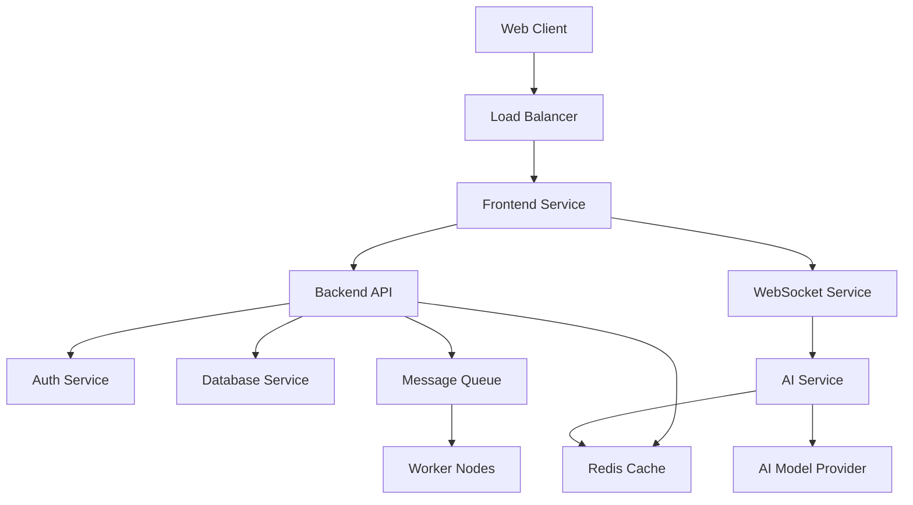
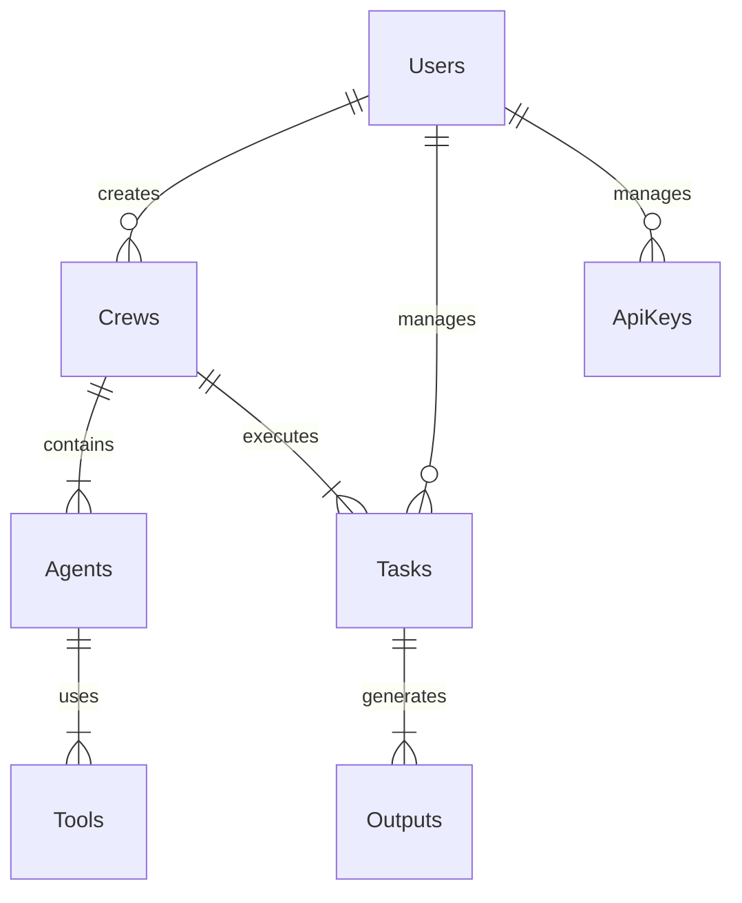

# CrewAI Platform Architecture

## System Overview

The CrewAI Platform is built using a microservices architecture deployed on Docker Swarm, enabling scalability, maintainability, and flexible deployment options.

## Core Services

### 1. Frontend Service (apps/web)
- Next.js application
- React-based UI components
- TailwindCSS for styling
- Role-based access control
- Real-time updates via WebSocket

### 2. Backend API Service (apps/api)
- FastAPI framework
- RESTful API endpoints
- JWT authentication
- Request validation
- Rate limiting
- API documentation (OpenAPI/Swagger)

### 3. AI Interaction Service (apps/chatbot)
- WebSocket communication
- AI model integration
- Message queue processing
- Stream handling
- Context management

### 4. Database Service
- PostgreSQL for persistent storage
- Redis for caching and real-time features
- Database migrations
- Backup management

## System Architecture

## Key Components

### Authentication & Authorization
- JWT-based authentication
- Role-based access control (RBAC)
- OAuth2 support for third-party integration
- Session management

### Database Schema

### API Layer
- RESTful endpoints
- WebSocket connections
- Request validation
- Response formatting
- Error handling
- Rate limiting

### Queue System
- Task processing
- Background jobs
- Event handling
- Retry mechanisms
- Dead letter queues

### Caching Layer
- Response caching
- Session storage
- Real-time data
- Rate limit tracking

## Security Measures

### Authentication
- JWT token validation
- Role-based access
- Session management
- Password hashing
- 2FA support

### Data Protection
- Data encryption at rest
- Secure communication (HTTPS/WSS)
- API key management
- Input validation
- Output sanitization

### Infrastructure Security
- Container isolation
- Network segmentation
- Secret management
- Regular updates
- Security monitoring

## Development Process

### Local Development
- Clone repository
- Install dependencies
- Set up environment
- Start development servers
- Run tests

### Deployment Process
1. Build Docker images
2. Run integration tests
3. Push to registry
4. Deploy to Swarm
5. Verify deployment

## Reference Documentation
- [API Documentation](./api.md)
- [Database Schema](./database.md)
- [Deployment Guide](./deployment.md)
- [Security Guide](./security.md)