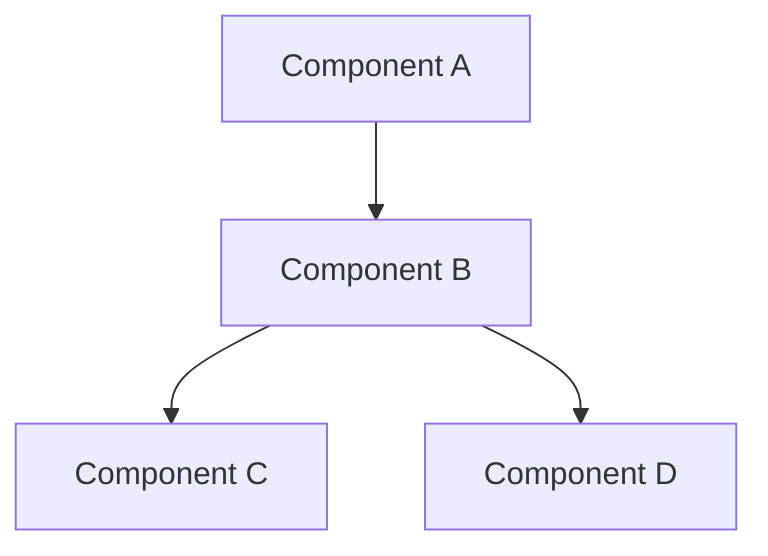

# Advanced Guide: [Topic Name]

## Overview
Brief explanation of what this advanced feature does and why it's important. Include use cases and benefits.

## Technical Background
Essential technical concepts and architecture overview needed to understand this feature.

### Architecture Diagram


### Key Concepts
1. Concept One
   - Detailed explanation
   - Technical implications
   - Common patterns

2. Concept Two
   - Implementation details
   - Best practices
   - Performance considerations

## Implementation Guide

### Prerequisites
- Advanced knowledge requirements
- System requirements
- Required permissions
- Dependencies

### Step-by-Step Implementation

#### 1. Initial Setup
```typescript
// Example configuration
interface AdvancedConfig {
  feature: {
    enabled: boolean;
    options: FeatureOptions;
  };
  performance: {
    optimization: OptimizationLevel;
    caching: CacheStrategy;
  };
}
```

#### 2. Core Implementation
```typescript
class AdvancedFeature {
  private config: AdvancedConfig;
  
  constructor(config: AdvancedConfig) {
    this.config = this.validateConfig(config);
  }

  // Implementation details...
}
```

#### 3. Integration Points
Explain how this feature integrates with other system components:
- API endpoints
- Event handlers
- Database interactions
- External services

## Advanced Configuration

### Configuration Options
```typescript
interface FeatureOptions {
  mode: 'standard' | 'advanced' | 'expert';
  customization: {
    [key: string]: any;
  };
  limits: {
    maxConcurrent: number;
    timeout: number;
  };
}
```

### Performance Tuning
- Optimization strategies
- Caching mechanisms
- Resource management
- Scaling considerations

## Security Considerations

### Authentication & Authorization
- Security model
- Access control
- Token management
- Audit logging

### Data Protection
- Encryption standards
- Data handling
- Privacy compliance
- Security best practices

## Monitoring & Troubleshooting

### Monitoring
```typescript
// Monitoring implementation
class FeatureMonitor {
  async collectMetrics(): Promise<Metrics> {
    // Monitoring logic
  }

  async checkHealth(): Promise<HealthStatus> {
    // Health check logic
  }
}
```

### Debugging
- Common issues
- Debug strategies
- Logging patterns
- Error handling

## Advanced Examples

### Example 1: Complex Integration
```typescript
// Complex integration example
async function integrateFeature() {
  const feature = new AdvancedFeature({
    // Advanced configuration
  });

  // Integration logic
}
```

### Example 2: Custom Implementation
```typescript
// Custom implementation
class CustomFeature extends AdvancedFeature {
  async handleSpecialCase(): Promise<Result> {
    // Custom logic
  }
}
```

## Best Practices

### Design Patterns
- Recommended patterns
- Anti-patterns to avoid
- Implementation strategies
- Code organization

### Performance Optimization
- Caching strategies
- Resource optimization
- Query optimization
- Load balancing

## Troubleshooting Guide

### Common Issues
| Issue | Cause | Solution |
|-------|-------|----------|
| Error A | Condition X | Solution 1 |
| Error B | Condition Y | Solution 2 |

### Diagnostics
```typescript
// Diagnostic tools
class Diagnostics {
  static async runDiagnostics(): Promise<DiagnosticReport> {
    // Diagnostic logic
  }
}
```

## Reference

### API Reference
- Detailed API documentation
- Request/Response examples
- Error codes
- Rate limits

### Configuration Reference
- Complete configuration options
- Default values
- Environment variables
- Feature flags

## Additional Resources
- Related documentation
- Technical papers
- Community resources
- Support channels

## Version History
| Version | Changes | Date |
|---------|---------|------|
| 2.0.0 | Feature X added | 2025-01 |
| 1.1.0 | Enhancement Y | 2024-12 |

## Template Notes
This template demonstrates:
- Technical depth while maintaining clarity
- Progressive disclosure of complex topics
- Practical examples and code snippets
- Comprehensive troubleshooting
- Clear reference materials