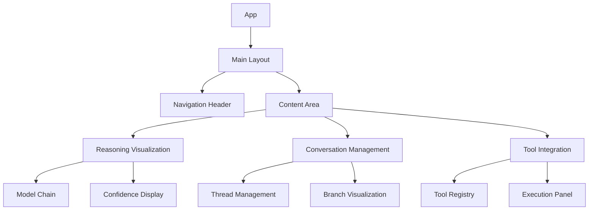

# CrewAI UI Implementation Plan

## Overview

This document outlines the plan for rebuilding the CrewAI UI with enhanced features based on existing documentation and code snippets.

## Core UI Components

### 1. Multi-Column Interface (from multi-column-chat-ui.tsx)
- Enhanced reasoning visualization
- Real-time Ollama instance monitoring
- Integrated chat interface

### 2. Conversation Explorer (from conversation-explorer.tsx)
- Thread-based conversation management
- Branch visualization
- Search functionality

### 3. AI Reasoning Interface (from ai-reasoning-chat.tsx)
- Model chain visualization
- Confidence metrics
- Real-time updates

### 4. CrewAI Chat Interface (from crew-ai-chat-interface.tsx)
- Agent role management
- Hierarchical message threading
- Real-time collaboration features

## Implementation Phases

### Phase 1: Core Infrastructure (Week 1)

1. **Component Library Setup**
   - Set up TailwindCSS configuration
   - Implement shared UI components
   - Create base layout structure

2. **State Management**
   - Implement Redux store for global state
   - Set up WebSocket connections
   - Create local storage utilities

3. **Base Components**
   - Message container
   - Agent cards
   - Tool panels
   - Navigation structure

### Phase 2: Core Features (Week 2)

1. **Reasoning Visualization**
   - Model chain visualization
   - Real-time status updates
   - Confidence metrics display

2. **Conversation Management**
   - Thread creation and management
   - Branch visualization
   - Search and filter capabilities

3. **Agent Integration**
   - Agent role definitions
   - Tool integration interface
   - Real-time agent status

### Phase 3: Advanced Features (Week 3)

1. **Enhanced Collaboration**
   - Real-time multi-agent visualization
   - Parallel processing display
   - Task delegation tracking

2. **Tool Integration**
   - Dynamic tool registration
   - Tool execution visualization
   - Result integration

3. **Performance Optimization**
   - Lazy loading for large conversations
   - WebSocket connection pooling
   - State management optimization

### Phase 4: Polish & Optimization (Week 4)

1. **UI/UX Improvements**
   - Responsive design
   - Accessibility enhancements
   - Theme customization

2. **Performance Monitoring**
   - Analytics integration
   - Error tracking
   - Performance metrics

3. **Documentation**
   - Component documentation
   - Usage guidelines
   - API references

## Component Architecture

## Technical Specifications

### 1. State Management
- Redux for global state
- React Context for theme/preferences
- Local storage for persistence
- WebSocket for real-time updates

### 2. Styling
- TailwindCSS for base styling
- CSS modules for component-specific styles
- CSS variables for theming
- Responsive design breakpoints

### 3. Performance Considerations
- Virtual scrolling for large lists
- Lazy loading for images/assets
- Debounced search
- Memoized components

### 4. Accessibility
- ARIA labels
- Keyboard navigation
- High contrast mode
- Screen reader support

## Integration Points

### 1. Backend Integration
- WebSocket connections for real-time updates
- REST API endpoints for data fetching
- File upload/download handling
- Error handling and retry logic

### 2. Tool Integration
- Dynamic tool registration
- Execution status tracking
- Result visualization
- Error handling

### 3. Agent Integration
- Role-based access control
- Agent status monitoring
- Task delegation
- Communication channels

## Success Metrics

1. **Performance**
   - Initial load time < 2s
   - Time to interactive < 3s
   - Smooth scrolling (60 fps)
   - Memory usage optimization

2. **User Experience**
   - Intuitive navigation
   - Clear feedback loops
   - Responsive interface
   - Error recovery

3. **Accessibility**
   - WCAG 2.1 compliance
   - Keyboard navigation
   - Screen reader support
   - High contrast support

## Next Steps

1. **Immediate Actions**
   - Set up development environment
   - Create component library
   - Implement base layout
   - Set up state management

2. **Week 1 Deliverables**
   - Working component library
   - Basic layout implementation
   - State management setup
   - Initial routing

3. **Review Points**
   - End of each phase
   - Performance testing
   - Accessibility audit
   - User feedback sessions